  
  
   
  
  
  
  
    
  
  
  
  
  

 

### 🧠 About Me

> _"I don't just chain prompts; I architect resilient, observable, and scalable AI systems."_

I am a GenAI & Full-Stack Engineer working **full-time as an Associate Developer (April 2025 – Present)**, with a strong focus on production-grade software. My expertise lies in bridging the gap between experimental LLM capabilities and robust, reliable systems. I specialize in designing stateful agentic workflows, optimizing RAG retrieval pipelines, and building high-throughput backend services that power real-world applications.

---

### 🛠️ The Architecture (Tech Stack)

<table>
  <tr>
    <td width="50%" valign="top">
      <h3>🧠 The Brain (GenAI & Data)</h3>
      
Orchestrating intelligence and memory.

      

        
        
        
        
        
      

    </td>
    <td width="50%" valign="top">
      <h3>⚙️ The Engine (Backend & Cloud)</h3>
      
High-performance, scalable, and containerized.

      

        
        
        
        
        
      

    </td>
  </tr>
  <tr>
    <td width="50%" valign="top">
      <h3>🎨 The Interface (Frontend)</h3>
      
Clean, responsive, and type-safe user experiences.

      

        
        
        
      

    </td>
    <td width="50%" valign="top">
      <h3>🔬 Current Experiments</h3>
      
Pushing the boundaries of my workflow.

      <ul>
        <li>Agentic Coding CLIs (<i>Antigravity, OpenCode</i>)</li>
        <li>Advanced RAG evaluation metrics</li>
        <li>Multi-modal AI pipeline optimization</li>
      </ul>
    </td>
  </tr>
</table>

---

### 🚀 Experience

#### 🏢 Associate Developer | _Full-time (April 2025 – Present)_

Focused on production software engineering — designing scalable database schemas, architecting robust APIs, and integrating reliable AI-enabled features into enterprise systems.

#### 🌐 Project Contributions | _Seagol Innovations_

Contributing to custom software delivery projects, handling database design, API architecture, and AI feature integration — from requirements through to production-ready implementation.

---

### 🚀 Featured Projects

#### 🏛️ HamroWard Platform | _Civic-Tech Project_

Contributed to a large-scale civic engagement platform. Worked on modular backend architecture, optimized PostgreSQL queries, and secure, role-based data access for high-concurrency usage.

#### 🔍 Enterprise Hybrid RAG System | _Personal Project_

A production-grade search pipeline featuring **intent-based routing** (Vector, BM25, SQL), parallel retrieval, RRF fusion, Cohere reranking, and automated Ragas evaluation with threshold alerting.

#### 📄 Self-Correcting Data Extraction Engine | _Personal Project_

An invoice extraction API powered by **LangGraph state loops** for self-correction. Parses documents/images, validates extracted data with Pydantic math checks, and retries with error context before persisting.

---

### 📊 System Metrics

  
  
  
    
  
  

 

  
    
      
    ⚡ Crafted with precision in Nepal 🇳🇵 • Let's build the future of AI together.
  

